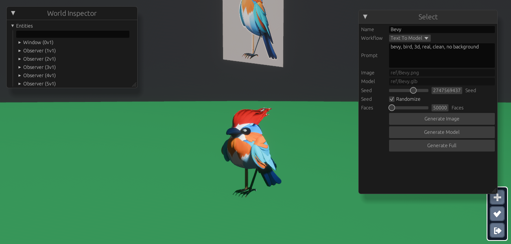
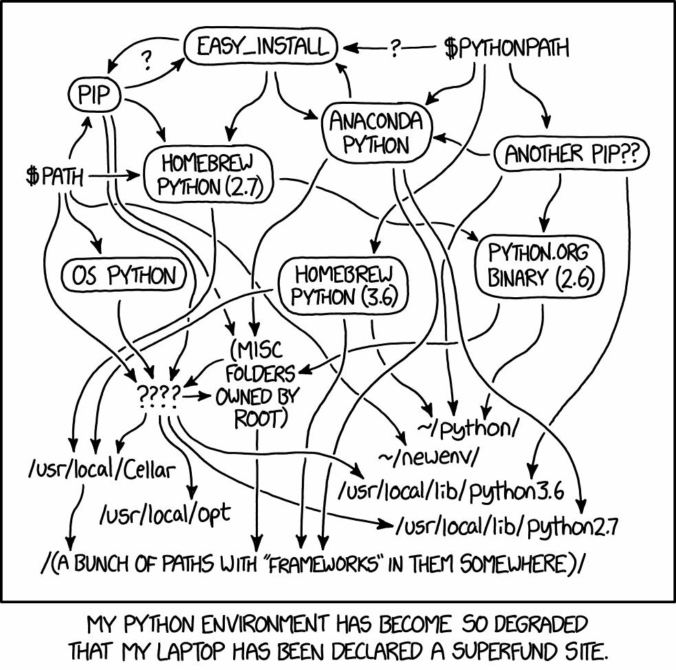

# sly ref prototype



Prototype for intergrating Comfy UI workflow with bevy for asset generation and wanted to try a few new features coming in bevy 0.16

> Will not be maintained, just an example for anyone that wants it, its a cursed workflow, but thats python for you.



# Comfyui setup

If you havent used comfy before, I wish you luck, its going to take a while

A thousand ways to install ComfyUI, different with every OS and distro, this is mine on Pop OS 24.04:

First assuming you have python `3.12` and nvidia card
with cuda working, see [cuda toolkit](https://developer.nvidia.com/cuda-downloads?target_os=Linux&target_arch=x86_64&Distribution=Ubuntu&target_version=24.04&target_type=deb_network)

All commands from here on will assume you in the comfyui repo, you have to install things by git clone into the custum_nodes, and downloading models and putting them in the correct model folders, everyone does this differently, gl.

> Needed for Python.h in Hunyuan3D
```bash
    sudo apt-get install python3-dev
    sudo apt-get install ffmpeg
    pip install xxhash 
```

```bash
git clone https://github.com/slyedoc/ComfyUI.git
cd ComfyUI
```
    
### Env Setup

```bash
python3 -m venv .venv
source .venv/bin/activate
pip install torch torchvision torchaudio --extra-index-url https://download.pytorch.org/whl/cu126
pip install -r requirements.txt
```

### Install ComfyUI_essentials

```bash
cd custom_nodes
git clone https://github.com/cubiq/ComfyUI_essentials.git
cd ComfyUI_essentials
pip install -r requirements.txt
cd ../..
```

### Install Hunyuan3DWrapper 

[ComfyUI-Hunyan3dWrapper](https://github.com/kijai/ComfyUI-Hunyuan3DWrapper)

[Blog](https://comfyuiblog.com/hunyuan3d-comfyui-workflow-2/#google_vignette) 

```bash
cd custom_nodes 
git clone https://github.com/kijai/ComfyUI-Hunyuan3DWrapper.git
cd ComfyUI-Hunyuan3DWrapper
pip install -r requirements.txt
cd hy3dgen/texgen/custom_rasterizer/
python setup.py install
cd ../../..
cd hy3dgen/texgen/differentiable_renderer
python setup.py build_ext --inplace
cd ../../..
cd hy3dgen/shapegen/bpt
pip install -r requirements.txt
cd ../../../../..
```

### Install MVAdapter
[ComfyUI-MVAdater](https://github.com/huanngzh/ComfyUI-MVAdapter)


```bash
cd custom_nodes
git clone https://github.com/huanngzh/ComfyUI-MVAdapter.git
cd ComfyUI-MVAdapter
pip install -r requirements.txt
mv workflow_examples example_workflows
```
> Note: Renaming workflows so they show as example


###  Install ComfyUI-Manager

You will need this to install tons of the missing nodes.

[ComfyUI Manager](https://github.com/ltdrdata/ComfyUI-Manager)

```bash
cd custom_nodes
git clone https://github.com/ltdrdata/ComfyUI-Manager comfyui-manager
```

> Do not hit "Update All" in this manager, its about 90% chance to brick ComfyUI


### Download models

These are a few of the models used, sorry I didnt keep this all updated, will need to fix any paths or missing ones, welcome to phython hell

```bash

mkdir -p models/diffusion_models/hy3dgen
wget -nc https://huggingface.co/Kijai/Hunyuan3D-2_safetensors/resolve/main/hunyuan3d-dit-v2-0-fp16.safetensors -P ./models/diffusion_models/hy3dgen

wget -nc https://huggingface.co/tencent/Hunyuan3D-2/resolve/main/hunyuan3d-dit-v2-0-turbo/model.fp16.safetensors -P ./models/diffusion_models/hy3dgen
mv ./models/diffusion_models/hy3dgen/model.fp16.safetensors ./models/diffusion_models/hy3dgen/hunyuan3d-dit-v2-turbo.safetensors

wget -nc https://huggingface.co/tencent/Hunyuan3D-2mv/resolve/main/hunyuan3d-dit-v2-mv-fast/model.fp16.safetensors -P ./models/diffusion_models/hy3dgen/
mv ./models/diffusion_models/hy3dgen/model.fp16.safetensors ./models/diffusion_models/hy3dgen/hunyuan3d-dit-v2-mv-fast.safetensors

wget -nc https://huggingface.co/tencent/Hunyuan3D-2mini/resolve/main/hunyuan3d-dit-v2-mini-turbo/model.fp16.safetensors -P ./models/diffusion_models/hy3dgen/
mv ./models/diffusion_models/hy3dgen/model.fp16.safetensors ./models/diffusion_models/hy3dgen/hunyuan3d-dit-v2-mv-mini-turbo.safetensors

wget -nc https://huggingface.co/tencent/Hunyuan3D-2mv/resolve/main/hunyuan3d-dit-v2-mv-turbo/model.fp16.safetensors -P ./models/diffusion_models/hy3dgen/
mv ./models/diffusion_models/hy3dgen/model.fp16.safetensors ./models/diffusion_models/hy3dgen/hunyuan3d-dit-v2-mv-turbo-fp16.safetensors

wget -nc https://huggingface.co/stabilityai/stable-diffusion-xl-base-1.0/resolve/main/sd_xl_base_1.0.safetensors -P ./models/checkpoints/

wget -nc https://huggingface.co/stabilityai/sdxl-vae/resolve/main/sdxl_vae.safetensors -P ./models/vae/
wget -nc https://huggingface.co/stabilityai/stable-zero123/resolve/main/stable_zero123.ckpt -P ./models/checkpoints/

wget -nc https://huggingface.co/nubby/blessed-sdxl-vae-fp16-fix/resolve/main/sdxl_vae-fp16fix-c-0.9.safetensors -P ./models/vae/

```

# Running it

From here on assuming your current directory is in this repo.

To keep assets generated within this repo and make it easy to reproduce things, I start comfy redirecting a few things, and use `./tools/comfy.sh` as a shortcut. your paths may differ, be sure to activate you .venv before running it

```bash
source ../ComfyUI/.venv/bin/activate
python ../ComfyUI/main.py --lowvram --output-directory art/output --user-directory art/user --input-directory art/input
```

You should be able to open ComfyUI ```http://127.0.0.1:8188/``` and start by trying few workflows in [workspaces](art/user/default/workflows/) though you will have to use ComfyUI-Manager to install missing stuff, download missing models from [Hugging Face](https://huggingface.co/) and [civitai]https://civitai.com/

# Finally

Assuming you got this far, you can run sly_ref, it uses workflows saved as json files [here](src/workflows/), and if you named anything differently than I did, you will have to update them as well by either by hand or export them with your changes and hope all the node ids stayed the same.  If they didnt you will need to update, 

Then start sly_ref, see [actions](src/actions.rs) for keymappings. 

GL

